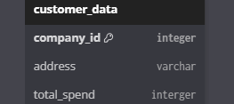
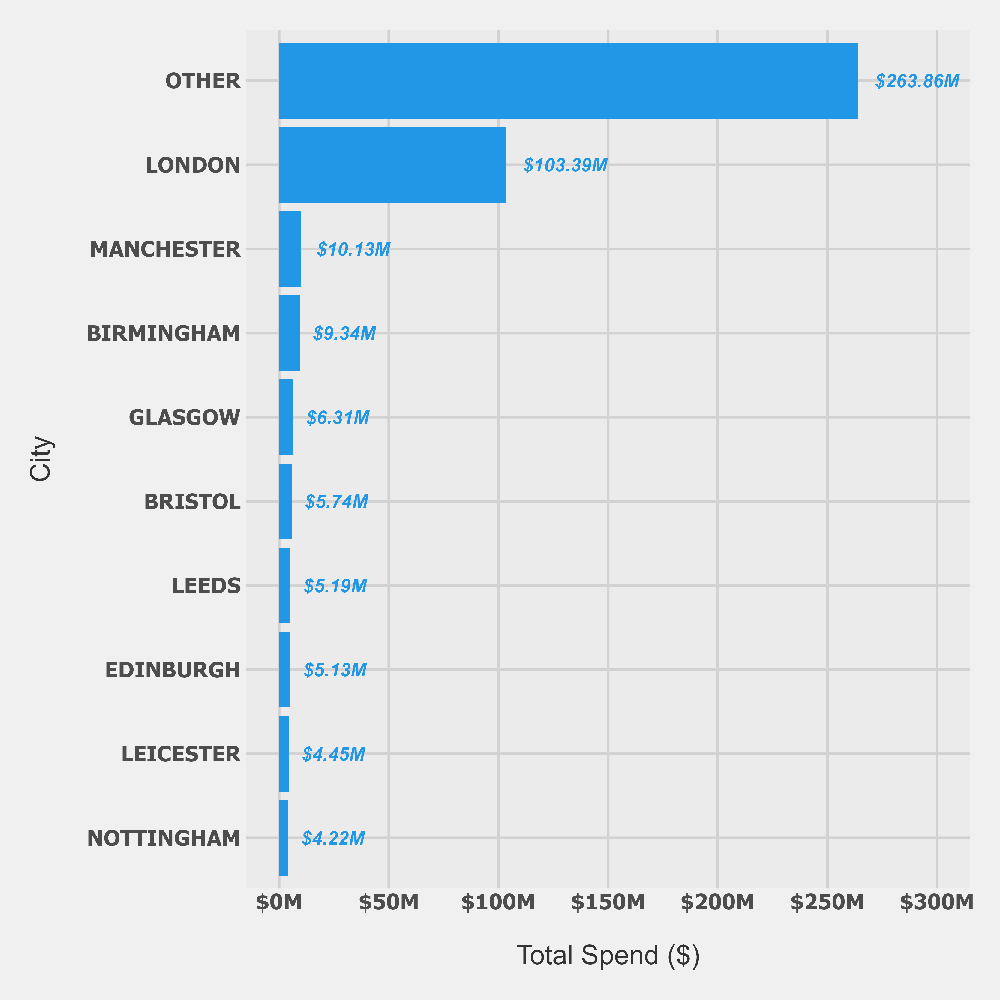
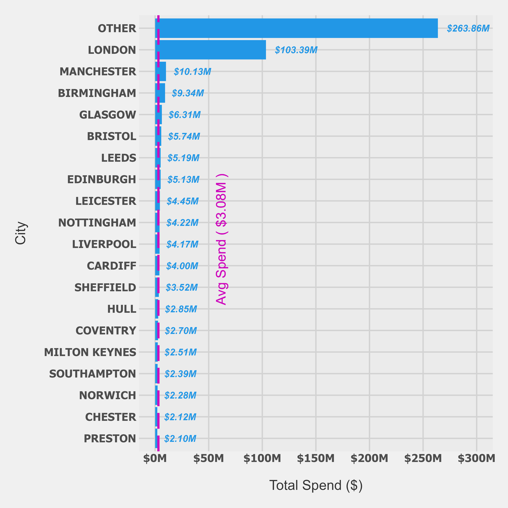

# ProWidget Systems
Lebintiti Kobe

- [Project Brief](#project-brief)
- [Analysis Scope](#analysis-scope)
- [Logical Framework (Analysis
  Approach)](#logical-framework-analysis-approach)
  - [a. “Spending Volumes” Of London Vs Rest
    UK](#a-spending-volumes-of-london-vs-rest-uk)
  - [b. “Primary Customer Based” City](#b-primary-customer-based-city)
  - [c. “Underserved” Cities](#c-underserved-cities)
- [Data Structure](#data-structure)
- [**Executive Summary**](#executive-summary)
- [Insights Deep Dive](#insights-deep-dive)
  - [1. London vs Other UK cities](#1-london-vs-other-uk-cities)
  - [2. Main “Customer Base”](#2-main-customer-base)
  - [3. “Underserved” cities](#3-underserved-cities)
- [Know Data Quality Issues](#know-data-quality-issues)
- [Understanding The Business Value](#understanding-the-business-value)
  - [What Current Analysis Is Good For
    :](#what-current-analysis-is-good-for-)
  - [What Current Analysis is Not Good For
    :](#what-current-analysis-is-not-good-for-)
- [Next Steps (IF There Is Business
  Value)](#next-steps-if-there-is-business-value)
  - [Improving data quality](#improving-data-quality)
  - [Using better metrics](#using-better-metrics)
- [The Key Question](#the-key-question)

# Project Brief

> As an analyst for ProWidget Systems, a UK-based B2B
> (business-to-business) retailer, you’ve been asked to report on
> spending volumes for London-based customers versus those based in the
> rest of the United Kingdom. The board has supplied a high-level data
> extract containing all customers’ addresses and their total spending
> to date.
>
> They want to know :
>
> Which UK cities are currently underserved
>
> Whether their customers are primarily London based

------------------------------------------------------------------------

# Analysis Scope

This is a rapid first pass analysis aimed to give quick ball-park
estimate , not precise and definitive figures

The goal is to quickly answer the stakeholders questions by giving
approximate directional insights . Once the insights are proven to be
valuable and we figured out the business value of the analysis , we will
iterate using better methodologies and metrics to get our results to be
as precise as possible

------------------------------------------------------------------------

# Logical Framework (Analysis Approach)

Assuming the goal is just to get ideas and ball-park estimates , not
precise figures ,

to answer the business questions at hand , these are the assumptions we
made :

------------------------------------------------------------------------

### a. “Spending Volumes” Of London Vs Rest UK

**Metric Used** : “Total Spend”

**Why** : Provides straight forward regional comparisons for quick
assessment

### b. “Primary Customer Based” City

**Definition** : City with highest total spend compared to other cities

**Why** : Highest total spend can imply high demand , more customers ,
high average spend per customer e.t.c , which aligns with goal of just
getting a quick idea of where our customer base is primarily based .

### c. “Underserved” Cities

**Definition** : City with total spend below the average total spend of
all UK cities

**Why** : It provides a simple baseline for us to get an idea of which
cities are potentially underserved .

------------------------------------------------------------------------

# Data Structure

We used data of 100K company records which gives us address and total
spend of each company .

------------------------------------------------------------------------

# **Executive Summary**

**London vs Other UK Cities:** London generates almost as much total
spend as all other UK cities combined, making it the primary revenue
driver.

**Underserved Cities:** Most UK cities fall below average spend levels.
Only large population centers exceed the mean, indicating potential
underservice across smaller markets.

**Primary Customer Base:** London leads in total spend, suggesting it
likely hosts our largest customer concentration.

**Key Limitation:** Analysis based on 43% of records due to address
parsing constraints. This affects precision but not the insights

**Next Step:** Confirm the business decision this will inform before
investing in deeper analysis.

------------------------------------------------------------------------

# Insights Deep Dive

## 1. London vs Other UK cities

***Total Spend By London Vs Other UK cities***

**Finding :** London (\$103M) has almost the same total spend as all
other UK cities (\$127M) combined

**Insight :** London is the main spending center in all of the UK

------------------------------------------------------------------------

## 2. Main “Customer Base”

***Total Spend by city***

**Finding :** London has the highest total spend compared to other UK
cities

**Insights :** London has the most customers , or high spend per
customer (or both) . London may be where our primary customer base is
situated

------------------------------------------------------------------------

## 3. “Underserved” cities

***Total Spend by City***

**Finding :** Cities with large population sizes tend to have total
spend greater than the average total spend of all UK cities . Cities
with low population sizes tend to have total spend below average .

**Insights :** Most UK cities fall below average suggesting potential
underservice . However this is highly affected by the cities populations
as Low population cities will of course low spend compare to bigger
sized UK cities

------------------------------------------------------------------------

# Know Data Quality Issues

**These affect precision of estimates but should not affect the insights
:**

1.  **City Extraction Method :**

    We used the UK government’s list of cities to extract cities from
    the addresses .

    This list excludes larger town which stakeholders might be
    interested in .

    Lastly , this approach only managed to successfully parse 43% of our
    addresses

2.  **Presence of Zero spend companies :**

    There are companies which had Zero spend , and we do not know
    whether to include these or exclude them .

3.  **Presence of companies with no addresses :**

    There companies ids with no addresses , this suggest system error or
    presence of other databases which might contain addresses info of
    the companies

4.  **Presence of multiple companies with the same addresses :**

    There are company ids which share the same address , in one instance
    there was an address that had over a thousand different company ids

------------------------------------------------------------------------

# Understanding The Business Value

Before we can proceed and iterate our initial analysis its important for
us to understand the business value of doing so .

What business decisions is this analysis going to support ?

### What Current Analysis Is Good For :

1.  **Quick directional comparisons** : London vs UK spend Volumes
2.  **Ball-park identifications of which city are underserved** and have
    low spend
3.  **Ball-park identifications of which city has highest spend** ,
    hence may have most customers

### What Current Analysis is Not Good For :

1.Precise market sizing and opportunity assessment

2\. Marketing budget allocation

3\. Strategic expansion planning

4\. Identifying true market penetration / saturation

------------------------------------------------------------------------

# Next Steps (IF There Is Business Value)

## Improving data quality

1.  **Using better city extraction method :**

- We can use postcodes in order to extract cities from our address ,
  this alone or together with Governments list method will parse even
  more addresses . This will require postcodes database of each UK city

- We can send our customers addresses to a MAPS API , like google API ,
  which will return cities that corresponds to each address in our data
  . This will get more addresses parsed but raise privacy concerns . Are
  we allow to send private / personal customer information to a third
  party organisation /API

2.  **Address zero spend records in our data**

- We can check if there were system error , then decide whether we
  should we include these or not .

3.  **Address companies with missing addresses**

- Is there a source of data in our company that may contain info on
  these companies ?

4.  **Address companies with same addresses**

- We can do confirmations , try to gather true companies address e.t.c

------------------------------------------------------------------------

## Using better metrics

1.  **Customer count per city :**

    This gives us a better estimate of which city has the most customers
    , hence where our primary customer base is located

2.  **Total Spend Per Capita :**

    This gives us a better estimation of which cities are underserved ,
    since it takes into consideration the population sizes of each .

3.  **Average Spend Per Customer :**

    This gives us a better estimation of which cities have our high
    value customers

These are just a few examples of what other metrics can be used based on
what business decisions the analysis could potentially support .

------------------------------------------------------------------------

# The Key Question

What business decisions is this analysis going to support ?
